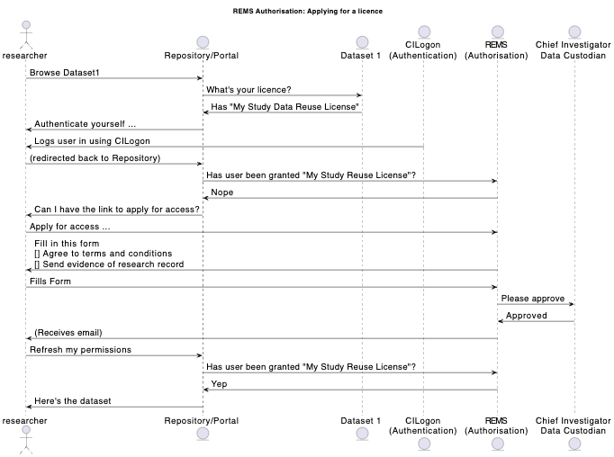
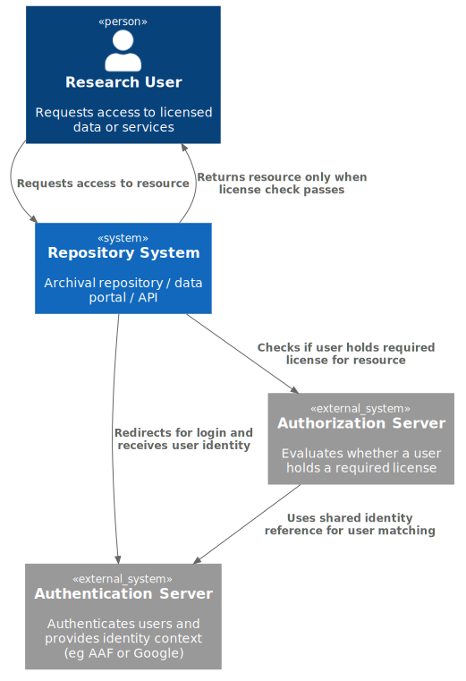

| Field                      | Value                                                                                                                                 |
| ---------------------------- | --------------------------------------------------------------------------------------------------------------------------------------- |
| Pattern ID                 | 1.0                                                                                                                                   |
| Title | **Distributed license-based access control for data and services**  |
| Slug                       | distributed-authorization                                                                                                             |
| Audience Includes (hidden) | HASS RSEs (building systems); University IT / eResearch Teams;                                                                        |
| Keywords                   | authentication, federated identity, SSO, single sign-on, AAF, CILogon, Identity Provider, OIDC, OAuth2, AARC, research infrastructure |
| Status                     | Draft                                                                                                                                 |
| Category | Authentication and Authorization |
| Type                       | Architecture                                                                                                                          |
| Author                     | Peter Sefton                                                                                                                          |
| Last Updated               | 2026-05-20                                                                                                                            |

# Summary

This pattern separates Authorization of user-agents and Authentication from an
Archival Repository or other service using a system of licence-granting. It is
designed to make authorization systems for software services as sustainable and
maintainable as possible, ensuring that data is available beyond the life of any
particular system, and can be housed in different systems simultaneously or over time.

Historically, the dominant authorization pattern has been for each system to
maintain Access Control Lists (ACLs) for granting access to resources,
sometimes with additional attributes stored per-person and/or group.
This pattern removes the need for access control lists and group-management in
individual applications by delegating both Authentication (log in) and
Authorization (does this person hold a particular license to do something?) to an
external system.

This pattern is suitable for data which does need to be distributed to users,
under license conditions to which they have agreed and been explictly or implicitly granted, with a defined process
(typically triggered by a potential user filling out a application form) . It is
not suitable for use in high-risk environments such as with medical or other personal data.

The same pattern can be used for access to services, such as computing.

| Recommendation                                                                                                                                                                                      | Why?                                                                                                                                                                                                                                                                                            |
| ----------------------------------------------------------------------------------------------------------------------------------------------------------------------------------------------------- | ------------------------------------------------------------------------------------------------------------------------------------------------------------------------------------------------------------------------------------------------------------------------------------------------- |
| Describe data and services with natural-language licenses specifying *who* is allowed to do *what* with the data/service and for *how long*                                                          | This information can always be used in the future to re-establish access control systems if needed, even if they are manual                                                                                                                                                                     |
| Store the license with the data                                                                                                                                                                     | Data does not become ‘orphaned’ and closed by default                                                                                                                                                                                                                                         |
| Avoid encoding complex social relationships into system-specific code or databases in a non-portable way                                                                                            | Mitigate the risks that (a) data access will be lost if that system becomes unavailable or (b) user privacy is breached in a research system (delegate to trusted authorities)                                                                                                                  |
| Separate the granting of licenses and authentication of people from archives and other services                                                                                                     | Archives and other research services can be simpler, and data can move between them with it licenses                                                                                                                                                                                            |
| Use one or more License Services to manage the administrative processes of license granting                                                                                                         | Not every system has to have the complexity and risk of maintaining user information, including potentially private attributes.                                                                                                                                                                 |
| Do not build complex access-control into every system, rather tie access to explicit licenses for reuse and share the management of user authentication and authorization across a community of use | PILARS protocol 1 - "Data is Portable: Assets are not locked-in to a particular mode of storage, interface or service."’ & The FAIR and CARE principles address*Access* to data, it is essenetial that data held in Archival Repositories architected to be independent of particular software |

Figure 1: Shows an Authentication/Authorization system in action. There are two services needed - one for Authentication (CILogon in this case) and a second one for Authorization (REMs, which uses the same Authentication service so can share user IDs with the repository service). These services might be delivered by the same application or could be separated -ie the authorization server *could* be "behind" the the License server.

## When this pattern applies

It is appropriate to use this pattern for data where it is acceptable to
allow actors to have their own copies of data assets, or to access systems
directly from their own computers, subject to license conditions. They may be
required to delete data after use, and there are typically restrictions on
re-sharing data, ranging from acknowledging copyright through to a complete ban
on any kind of redistribution.

This pattern may be used for adding authorization workflows to data assets,
which was the primary motivator for its creation, but it may also be used to
grant access to services.

To implement this pattern you must have a way of adding license information to a
data-record, at least via it's metadata. This implies having some form of
Archival Repository in the terms of [The Model].

### When this pattern does not apply

Do not use this pattern:

- If there are trusted authorization systems already in place.
- When there are serious risks from data-leakage. In this case, use a Secure
  eResearch System or similar controlled environment.

### Usage

This section assumes context of Data Access in an repository, data portal, API
or similar data delivery system facilitating data Access. It can be adapted for
services (TODO: write up the AARNet pattern for Binderhub)

The main steps in implementing this pattern

#### Preparation

For this pattern to work, two things must be in place. NOTE that these can be provided by the same application:

1. An Authentication service typically using OAuth or a similar protocol. Two examples include:
   - Single Signon (SSO) service:
     - Github  or another  - users can self-register for an account.
     - CILogon, which is an open-source enterprise system, available as a service by subscription (at enterprise-level price point). This is available to projects under the ARDC HASS&I RDC.
     - The Australian Access Federation (AAF)
    - A local authorization service with usernames and passwords eg an LDAP implementation.

2.  An Authorization Server - which in this case is a "license server" that can verify whether a given user holds a license. This should have 
    -  A way to store license workflows with at least a way for an administrator to grant a license.
    - In a fully featured system:
      - A registry of licenses which may be publicly discoverable or not according to their metadata 
      - A (set of) form(s) that trigger an approval workflow.
    - An API endpoint to verify wether a user-ID from the Authentication Service hold a given license.git ad

See the Implementation Pattens below for more specific information.

#### In use

To use this pattern:

- Factor data into a set of digital objects each with one or more
  natural language license documents describing who can access the data
  and what they can do with it (keep it for how long, reuse parts of it,
  republish). Ideally store the license with the data and
  its metadata, but at a minimum link to it from the data, via its metadata.
- For each license, work out a process for how actors may be granted that
  license. Options include:
  -  For Open Access and similar, explicit granting is not required
  -  Click-through agreement to license terms, recording the user's identity
  -  Delegating approval to one or more administors, with a notification to approve
  -  Working on a convention where, for example, membership of a particular group in an authentication system explicitly denotes holding a license. (eg membership of a Github groups within a Github Organization)
  
    
Licenses must:
- Be associated with an authorization service (license server). This could be the same for all licenses in a system, or configurable.
- Have sufficient metadata and approval forms associated with them for the range of authorization services required in a given implementation. 

When an actor requests access to a resource, the system must:

- Retrieve the license(s) for the resource
  - If a license allows for unmediated immediate access (eg Open Access or
Open Source) then allow access.

  - If a license(s) require some authorization:
     - Get the actor's ID via a login to the Authorization service, or a locally managed token (API Key)
     - Get a list of licenses held by a user from the Authorization Service
     - Give or withold the resource based on the answer above

 - If a user does not hold a license, and the license metadata indicated an application pathway, the user may be directed to that, for example to an application form.

## Implementations

# References

### Principles

[PILARS] <-- TODO: should we have a set of standard refs like this that get added to the pipeline so markdown links just work?

### Patterns

### Models

[HASS&I RDM Concept Model]

### Other resources

## Citation

## Acknowledgments

# TODO

